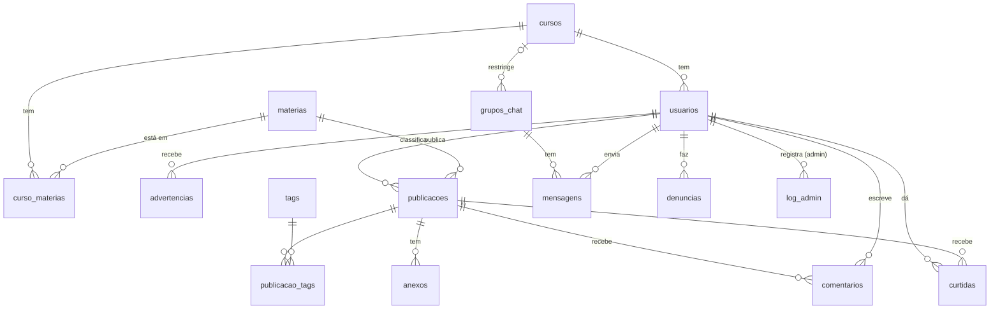
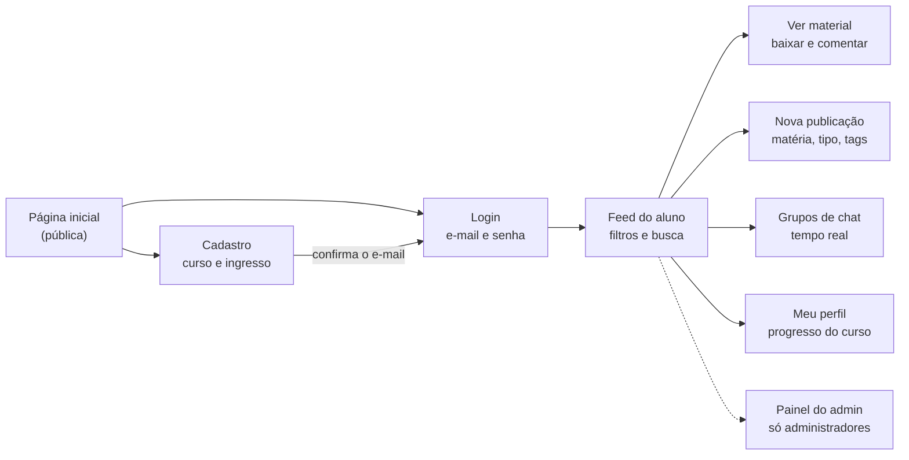

# HelpIF — Planejamento do Projeto

**Data:** 02/10/2026
**Disciplina:** Oficina de Integração — IFSC Campus Chapecó
**Versão online (editável pelo grupo):** https://claude.ai/code/artifact/0fb8dec4-9191-4aa0-9366-94c8dd39cd8d

> Este arquivo é a cópia local do planejamento. Ele serve de referência para a implementação.
> Quando alguma decisão mudar, atualize aqui também (veja o "Histórico de alterações" no fim).

---

## Sumário

1. [Visão geral](#1-visão-geral)
2. [Perfis e permissões](#2-perfis-e-permissões)
3. [Funcionalidades](#3-funcionalidades)
4. [Modelo de dados](#4-modelo-de-dados)
5. [Telas e navegação](#5-telas-e-navegação)
6. [Identidade visual](#6-identidade-visual)
7. [Tecnologias e decisões em aberto](#7-tecnologias-e-decisões-em-aberto)
8. [Fases do projeto](#8-fases-do-projeto)
9. [Segurança, LGPD e regras de conteúdo](#9-segurança-lgpd-e-regras-de-conteúdo)
10. [Próximos passos e backlog](#10-próximos-passos-e-backlog)

---

## 1. Visão geral

O HelpIF é um fórum de estudos fechado para alunos do IFSC Campus Chapecó, onde qualquer aluno cadastrado publica e encontra materiais filtrados por curso, semestre e matéria.

| Item | Definição |
| --- | --- |
| Problema | Materiais bons (provas antigas, resumos, mapas mentais) ficam espalhados em grupos de WhatsApp e pastas pessoais e se perdem a cada turma. |
| Objetivo | Um lugar único e confiável para achar material direcionado às matérias do campus, inclusive as técnicas. |
| Público | Alunos do ensino médio técnico do campus (usuários) e o grupo do projeto (administradores). |
| Pilares | 1) Compartilhar material · 2) Encontrar rápido por filtros · 3) Socializar no chat · 4) Moderação pelos administradores. |
| Fora do escopo na v1 | App de celular nativo, chat privado entre alunos, integração com o SIGAA. |

---

## 2. Perfis e permissões

São dois perfis: **Aluno** (todo cadastro novo) e **Administrador** (o grupo do projeto). Um administrador só é criado por outro administrador, nunca pelo cadastro público.

| Ação | Aluno | Administrador |
| --- | --- | --- |
| Ver, buscar e filtrar publicações | Sim | Sim |
| Publicar material | Sim | Sim |
| Editar ou apagar publicação | Só as próprias | Qualquer uma |
| Comentar e curtir | Sim | Sim |
| Denunciar publicação ou mensagem | Sim | — (recebe as denúncias) |
| Mandar mensagem nos grupos de chat | Sim | Sim |
| Apagar mensagem do chat | Só as próprias | Qualquer uma |
| Cadastrar cursos, matérias e tags | Não | Sim |
| Criar e fechar grupos de chat | Não | Sim |
| Ver lista de contas e filtrar por curso/semestre | Não | Sim |
| Bloquear ou excluir conta | Não | Sim |
| Promover aluno a administrador | Não | Sim |

---

## 3. Funcionalidades

São seis módulos. Cada um tem uma lista de requisitos (RF = requisito funcional, ou seja, uma função que o sistema precisa ter). Cada RF vira uma tarefa na implementação.

### 3.1 Cadastro e login

- **RF01** — Cadastro com nome, e-mail, senha, curso e ano/semestre de **ingresso**.
- **RF02** — Aceitar só e-mail institucional do aluno: domínio `@aluno.ifsc.edu.br` (decidido em 02/10/2026; conferir se é mesmo esse o domínio dos alunos).
- **RF03** — Confirmação por link enviado ao e-mail antes do primeiro acesso.
- **RF04** — Senha com no mínimo 8 caracteres, guardada criptografada (nunca em texto puro).
- **RF05** — Login, logout e "esqueci minha senha".
- **RF06** — Aceite dos termos de uso e da política de privacidade no cadastro (data e hora do aceite ficam gravadas).
- **RF36** — Editar o próprio perfil: nome, foto e senha. Troca de curso só pelo admin (muda curso e ingresso juntos).
- **RF37** — Excluir a própria conta (LGPD). Publicações e comentários continuam, mas o autor aparece como "Usuário removido".
- **RF38** — O primeiro administrador é criado por um script de dados iniciais (*seed*) direto no banco; depois disso só um admin promove outro.

### 3.2 Progresso de semestre em tempo real

O aluno não digita "estou no 3º semestre": ele informa quando **entrou**, e o sistema calcula onde ele está hoje. Assim a informação se renova sozinha a cada virada de período.

- **RF07** — Cada curso tem tipo de período (anual ou semestral) e duração total (ex.: 4 anos ou 6 semestres), cadastrados pelo admin.
- **RF08** — O admin cadastra o calendário acadêmico (data de início de cada ano/semestre letivo).
- **RF09** — Período atual = períodos letivos já iniciados desde o ingresso + ajuste manual.
- **RF10** — No início de cada período, o aluno confirma num aviso: "Você está no 4º semestre?". Se reprovou ou trancou, ele corrige, e isso grava o ajuste.
- **RF11** — Perfil mostra uma barra de progresso do curso (ex.: 3 de 6 semestres, 50%).
- **RF12** — Ao chegar ao fim do curso, a conta vira "egresso" e continua podendo ler e publicar.
- **RF39** — Se o período letivo atual ainda não estiver no calendário, o sistema usa o último período cadastrado e avisa o admin no painel ("Cadastre o calendário de 2027/1").

**Exemplo do cálculo:**

| Situação | Valor |
| --- | --- |
| Curso | Semestral, 6 semestres |
| Ingresso | 2025/1 |
| Hoje | 02/10/2026 (dentro de 2026/2) |
| Períodos iniciados desde o ingresso | 2025/1, 2025/2, 2026/1, 2026/2 = 4 |
| Ajuste (reprovou 1 semestre) | −1 |
| **Período atual** | **3º semestre** (50% do curso) |

### 3.3 Publicação de materiais

- **RF13** — Criar publicação com título, descrição, matéria (obrigatória), tipo de material e até 5 tags.
- **RF14** — Tipos de material: anotação, resumo, prova antiga, trabalho antigo, mapa mental, lista de exercícios, link, outro.
- **RF15** — Anexos: PDF, imagem, DOCX/PPTX ou link externo (limite sugerido: 10 MB por arquivo).
- **RF16** — Comentar, curtir ("útil") e salvar nos favoritos.
- **RF17** — Denunciar publicação ou comentário (vai para a fila de moderação do admin).
- **RF40** — Publicações entram direto no feed, sem aprovação prévia (decidido em 02/10/2026); a moderação é feita por denúncia.
- **RF41** — Anexos são privados: só quem está logado baixa, por link temporário. O tipo do arquivo é conferido pelo conteúdo, não só pela extensão.
- **RF18** — Selo "verificado" que o admin pode dar a materiais conferidos (reforça o "material confiável").

### 3.4 Tags, filtros e busca

- **RF19** — Filtros combináveis: curso, semestre/ano, matéria, tipo de material, tag.
- **RF20** — Busca por palavra no título e na descrição, sem diferenciar acento e maiúscula ("matematica" encontra "Matemática").
- **RF21** — Ordenar por mais recentes, mais curtidos e mais comentados.
- **RF22** — Feed inicial já filtrado pelo curso e semestre atual do aluno (usa o RF09).
- **RF23** — Matérias e tags "oficiais" são cadastradas pelo admin; o aluno só escolhe da lista, para evitar "Matematica", "mat" e "MATEMÁTICA" como tags diferentes.
- **RF42** — Feed paginado com botão "Carregar mais" (20 publicações por vez).

### 3.5 Chat público

- **RF24** — Grupos de chat criados pelo admin (ex.: "Geral", "Informática – 3º ano", "Dúvidas de Cálculo").
- **RF25** — Grupo pode ser aberto a todos ou restrito a um curso/semestre.
- **RF26** — Mensagens aparecem em tempo real, sem recarregar a página.
- **RF27** — Histórico das mensagens, com nome, curso e horário de quem enviou.
- **RF28** — Denunciar mensagem; admin apaga mensagem e pode silenciar um usuário.

### 3.6 Painel do administrador

- **RF29** — CRUD de cursos, matérias, tags e calendário (CRUD = criar, ler, atualizar e apagar).
- **RF30** — Lista de contas com filtro por curso, semestre, situação (ativa, bloqueada, egresso) e data de cadastro.
- **RF31** — Bloquear, desbloquear, excluir conta e promover a administrador.
- **RF32** — Fila de denúncias (publicações e mensagens) com ações: manter, apagar, advertir o autor.
- **RF33** — Gestão dos grupos de chat (criar, renomear, restringir, arquivar).
- **RF34** — Números de uso: total de alunos, publicações por matéria, matérias sem nenhum material.
- **RF35** — Registro de ações dos admins (quem apagou o quê e quando).
- **RF43** — Advertências ficam gravadas na conta do aluno; o admin vê quantas o aluno já recebeu antes de decidir bloquear.

### 3.7 Requisitos não funcionais

RNF = requisito não funcional, ou seja, uma qualidade que o sistema precisa ter (não é uma função).

- **RNF01** — Celular primeiro: tudo funciona a partir de 360 px de largura.
- **RNF02** — Navegadores: versões atuais de Chrome, Firefox, Edge e Safari (celular).
- **RNF03** — Acessibilidade: contraste mínimo de 4,5:1 em textos (WCAG AA), campos de formulário com rótulo, navegação por teclado.
- **RNF04** — Feed carrega em menos de 3 s numa conexão 4G.
- **RNF05** — Anti-spam: no máximo 5 publicações por hora e 1 mensagem de chat a cada 2 s por usuário.
- **RNF06** — Toda tela tem estado de "carregando", "vazio" (ex.: "Nenhum material desta matéria ainda — seja o primeiro!") e "erro"; endereço inexistente mostra página 404.
- **RNF07** — Apagar é lógico (o item some da tela, mas fica no banco com data de exclusão) para o log de moderação continuar fazendo sentido.

---

## 4. Modelo de dados

O banco começa com 14 tabelas (ou grupos de tabelas).
**PK** = identificador único da linha. **FK** = campo que aponta para outra tabela.

| Tabela | Campos principais | Liga com |
| --- | --- | --- |
| usuarios | id (PK), nome, email, perfil (aluno/admin), curso_id (FK), ano_ingresso, periodo_ingresso, ajuste_periodo, ultima_confirmacao_periodo, situacao, silenciado_ate, foto_url, aceite_termos_em, criado_em | cursos |
| cursos | id, nome, sigla, tipo_periodo (anual/semestral), duracao_periodos | — |
| calendario_letivo | id, ano, periodo, data_inicio, data_fim | — |
| materias | id, nome, tecnica (sim/não) | — |
| curso_materias | curso_id, materia_id, periodo_sugerido | cursos, materias |
| tags | id, nome | — |
| publicacoes | id, autor_id (FK), materia_id (FK), titulo, descricao, tipo_material, verificado, criado_em, atualizado_em, excluido_em | usuarios, materias |
| publicacao_tags | publicacao_id, tag_id | publicacoes, tags |
| anexos | id, publicacao_id (FK), tipo (arquivo/link), url (link), caminho (arquivo no Storage), nome_original, tipo_mime, tamanho | publicacoes |
| comentarios | id, publicacao_id, autor_id, texto, criado_em, excluido_em | publicacoes, usuarios |
| curtidas / favoritos | usuario_id, publicacao_id | usuarios, publicacoes |
| grupos_chat e mensagens | grupo: id, nome, curso_id (opcional), periodo (opcional), ativo · mensagem: id, grupo_id, autor_id, texto, criado_em, excluido_em | cursos, usuarios |
| denuncias e log_admin | denúncia: id, tipo_alvo (publicação/comentário/mensagem), alvo_id, autor_id, motivo, status, criado_em, resolvido_por, resolvido_em · log: id, admin_id, acao, tipo_alvo, alvo_id, detalhes, data | usuarios |
| advertencias | id, usuario_id, admin_id, denuncia_id (opcional), motivo, criado_em | usuarios, denuncias |

Com o Supabase, a senha não fica na tabela `usuarios`: o serviço de login (Supabase Auth) guarda o hash dela separado, e `usuarios.id` é o mesmo id da conta de login.

Uma matéria pode estar em vários cursos (ex.: Português), por isso a ligação curso ↔ matéria fica na tabela `curso_materias`.

O período atual do aluno **não é gravado**: é calculado na hora a partir de `ano_ingresso`, `periodo_ingresso`, `calendario_letivo` e `ajuste_periodo`. É isso que faz ele se atualizar sozinho.

### Diagrama das tabelas

> O bloco abaixo está em **Mermaid** (linguagem que desenha diagramas a partir de texto). O GitHub e o VS Code (com a extensão "Markdown Preview Mermaid Support") mostram ele como desenho.



---

## 5. Telas e navegação

A v1 tem 9 telas. Só a página inicial, o cadastro e o login são abertos; o resto exige estar logado.



| # | Tela | Acesso | O que tem |
| --- | --- | --- | --- |
| 1 | Página inicial | Pública | Apresentação do HelpIF, botões "Entrar" e "Criar conta" |
| 2 | Cadastro | Pública | Nome, e-mail, senha, curso, ano/semestre de ingresso, aceite dos termos |
| 3 | Login | Pública | E-mail, senha, "esqueci minha senha" |
| 4 | Feed do aluno | Logado | Lista de publicações, filtros, busca, ordenação |
| 5 | Ver material | Logado | Material, anexos, comentários, curtir, favoritar, denunciar |
| 6 | Nova publicação | Logado | Formulário com matéria, tipo, tags e anexos |
| 7 | Grupos de chat | Logado | Lista de grupos e conversa em tempo real |
| 8 | Meu perfil | Logado | Dados, barra de progresso do curso, minhas publicações, favoritos |
| 9 | Painel do admin | Só admin | Abas: contas, cursos e matérias, tags, calendário, grupos de chat, denúncias |

O feed é a tela principal e leva a todas as outras. O painel do admin só aparece no menu de quem é administrador.

---

## 6. Identidade visual

Visual limpo de fórum profissional: fundo branco, verde IF como cor de ação, vermelho só em detalhes pequenos.

> Os códigos de cor abaixo são os mais usados para a marca dos Institutos Federais. **Conferir no manual de identidade visual da Rede Federal** antes de fechar o design.

| Uso | Cor | Código |
| --- | --- | --- |
| Principal: botões, links, cabeçalho, itens ativos | Verde IF | `#2F9E41` |
| Hover (passar o mouse) e textos sobre fundo claro | Verde escuro | `#1E6B2B` |
| Fundos de destaque suaves (tags, cards selecionados) | Verde clarinho | `#E8F5EA` |
| Fundo da página e dos cards | Branco | `#FFFFFF` |
| Fundo de áreas secundárias | Cinza claro | `#F5F7F6` |
| Texto principal | Cinza quase preto | `#1F2421` |
| Detalhes: notificações, selo "novo", denúncia, erro | Vermelho IF | `#CD191E` |

> **Atenção ao contraste:** o verde IF `#2F9E41` sobre branco tem contraste de cerca de 3,4:1, abaixo dos 4,5:1 que a acessibilidade (WCAG AA) pede para texto normal. Texto branco sobre o verde IF tem o mesmo problema. Por isso: **textos, links e fundo de botões usam o verde-escuro `#1E6B2B`** (cerca de 6,6:1). O verde IF fica para ícones, bordas, barra de progresso, sublinhado do menu ativo e a logo.

Sugestão para o CSS (variáveis de cor, para trocar tudo num lugar só):

```css
:root {
  --verde-if: #2F9E41;
  --verde-escuro: #1E6B2B;
  --verde-claro: #E8F5EA;
  --branco: #FFFFFF;
  --cinza-fundo: #F5F7F6;
  --texto: #1F2421;
  --vermelho-if: #CD191E;
}
```

**Logo** — símbolo do IF (quadrados verdes + círculo vermelho) à esquerda e o nome "HelpIF" à direita, com "Help" em cinza-escuro e "IF" em verde. Versões: horizontal (cabeçalho), só símbolo (ícone da aba do navegador) e versão branca (sobre fundo verde). Antes de publicar fora da turma, confirmar com o campus se o uso do símbolo oficial está liberado.

**Tipografia** — fonte Open Sans (a mesma família usada na marca dos IFs) ou Inter, ambas gratuitas no Google Fonts. Tamanhos: título 24 px, subtítulo 18 px, texto 15 px.

**Componentes de interface**

- Cards de publicação com borda fina cinza, cantos arredondados de 8 px, sem sombra pesada.
- Tags em formato de "pílula" verde-clarinho com texto verde-escuro.
- Ícone por tipo de material (prova, resumo, mapa mental…) para leitura rápida.
- Barra de progresso do curso no perfil, em verde.
- Toque escolar: avatar com a sigla do curso e selo do semestre (ex.: "INFO · 3º ano").
- Layout responsivo (se adapta à tela): funciona no celular, que é onde a maioria dos alunos vai acessar.

---

## 7. Tecnologias e decisões em aberto

**Recomendação:** front-end (a parte que o usuário vê) em HTML/CSS/JavaScript, ou React se o grupo já souber, e back-end (a parte do servidor) no **Supabase**. Ele já entrega login, banco, arquivos e chat em tempo real prontos e tem plano gratuito.

| Opção | O que é | A favor | Contra |
| --- | --- | --- | --- |
| A) Supabase (recomendada) | Serviço pronto com banco PostgreSQL, login, armazenamento de arquivos e tempo real | Menos código de servidor; login por e-mail e confirmação já prontos; grátis para projeto escolar | Depende de um serviço externo; regras de segurança (RLS) exigem estudo |
| B) Node.js + Express + Socket.IO + MySQL | Servidor próprio escrito pelo grupo | Aprende-se mais sobre back-end; controle total | Mais trabalho: login, upload e chat feitos do zero; precisa hospedar |
| C) PHP + MySQL | Servidor tradicional, comum em disciplinas técnicas | Talvez já visto em aula; hospedagem barata | Chat em tempo real é mais difícil |

Hospedagem sugerida: front-end na Vercel ou Netlify (grátis); código no GitHub, com cada integrante em sua própria branch (cópia de trabalho separada do código).

**Decisões que o grupo precisa tomar**

- [x] Qual pilha de tecnologia? → **A) Supabase + React** (React com Vite no front-end).
- [x] Exigir e-mail institucional? → **Sim, `@aluno.ifsc.edu.br`.**
- [x] Publicações entram direto ou passam por aprovação? → **Entram direto**, moderação por denúncia.
- [ ] Quais cursos do campus entram na primeira versão?
- [ ] Limite de tamanho de arquivo e tipos aceitos (proposta atual: 10 MB; PDF, PNG, JPG, DOCX, PPTX).

**Cuidados com o plano grátis do Supabase**

- O projeto é **pausado depois de cerca de 1 semana sem uso**. Antes da turma piloto e da apresentação, acessar o sistema ou reativar o projeto no painel.
- Limites aproximados: 500 MB de banco e 1 GB de arquivos. Por isso o limite de 10 MB por anexo.
- Fazer cópia (backup) do banco antes de cada entrega.

---

## 8. Fases do projeto

O projeto anda em 6 fases; cada uma só começa quando a anterior funciona. As datas entram aqui assim que o grupo souber o prazo de entrega da disciplina.

| Fase | Nome | O que entra | Portão ao final |
| --- | --- | --- | --- |
| 0 | Planejamento | Este documento, decisões da seção 7, protótipo das telas; levantar cursos, matérias e calendário reais | Professor aprova o planejamento |
| 1 | Base | Cadastro, login e confirmação de e-mail (RF01–RF06); progresso de semestre; cursos e matérias no admin (RF07–RF12, RF29) | — |
| 2 | Materiais | Publicar com anexos e tags (RF13–RF18); filtros, busca e feed do semestre (RF19–RF23) | **MVP:** um aluno publica e outro encontra o material |
| 3 | Comunidade | Grupos de chat em tempo real (RF24–RF28); comentários, curtidas e favoritos | — |
| 4 | Moderação e testes | Painel de contas, denúncias e log (RF30–RF35); teste com uma turma piloto e correções | Turma piloto usa sem erro grave |
| 5 | Entrega | Apresentação na Oficina de Integração; documentação e manual de uso | — |

O portão em destaque é o **MVP** (versão mínima que já resolve o problema): se o prazo apertar, o que vem depois dele pode ser simplificado sem perder o essencial.

---

## 9. Segurança, LGPD e regras de conteúdo

A plataforma guarda dados pessoais de alunos menores de idade, então coletar o mínimo e proteger o acesso é obrigatório (LGPD, Lei 13.709/2018).

- Coletar só o necessário: nome, e-mail, curso e ingresso. Nada de CPF, telefone ou endereço.
- Senhas sempre criptografadas; chaves de API e senhas do banco fora do código (em variáveis de ambiente, um arquivo `.env` que **nunca** vai para o GitHub).
- Lista de contas visível só para administradores; aluno vê só nome, curso e semestre dos colegas.
- O aluno pode pedir a exclusão da própria conta.
- Termos de uso proibindo: cola durante avaliação em andamento, conteúdo ofensivo, dados de terceiros e material protegido por direito autoral (ex.: livro inteiro em PDF).
- Combinar com os professores se provas antigas podem ser publicadas.
- Toda exclusão feita por admin fica registrada no log (RF35).
- Guardar data e hora do aceite dos termos (RF06), como prova do consentimento.
- **Menores de idade:** confirmar com a coordenação do campus se é preciso um termo de ciência dos responsáveis.
- Escrever o texto real dos Termos de Uso e da Política de Privacidade (o que é coletado, para quê, por quanto tempo e como pedir a exclusão).
- Anexos privados com link temporário (RF41) e limite anti-spam (RNF05).
- Regras de segurança do banco (RLS no Supabase) ativadas em **todas** as tabelas: sem regra, a tabela fica fechada.

---

## 10. Próximos passos e backlog

Antes de começar a programar, o grupo fecha as decisões da seção 7 e desenha as telas.

- [ ] Responder as decisões em aberto da seção 7.
- [ ] Levantar os cursos, matérias e calendário letivo reais do campus.
- [ ] Baixar o símbolo oficial do IF e montar a logo HelpIF.
- [ ] Desenhar as telas principais (protótipo no Figma ou em HTML).
- [ ] Dividir os módulos da seção 3 entre os integrantes.
- [ ] Criar o repositório no GitHub e o projeto no serviço escolhido.
- [ ] Mostrar o planejamento ao professor da disciplina.
- [ ] Escrever critérios de aceite para cada RF (viram os casos de teste da fase 4).
- [ ] Combinar regras do Git: nome das branches (`feat/cadastro`, `fix/login`), todo PR revisado por outro integrante, README com o passo a passo para rodar o projeto.

**Ideias para depois da v1 (backlog)**

- Notificações quando sai material novo da matéria que o aluno segue.
- Ranking de quem mais ajuda (pontos por publicação curtida).
- Pré-visualização de PDF dentro da página.
- Modo escuro.
- Calendário de provas por turma.

---

## Histórico de alterações

| Data | Alteração |
| --- | --- |
| 02/10/2026 | Versão inicial do planejamento (seções 1 a 10). |
| 02/10/2026 | Decididos: Supabase + React, e-mail `@aluno.ifsc.edu.br`, publicação sem aprovação prévia. Novos RF36–RF43 e RNF01–RNF07. Modelo de dados ampliado (curso_materias, advertencias, exclusão lógica). Nota de contraste do verde IF. Cuidados com o plano grátis do Supabase e itens extras de LGPD. |
| 02/10/2026 | Fase 2 implementada (`0002_materiais.sql`): limite de 5 anexos por publicação; `anexos.caminho` guarda o arquivo do Storage; filtro de curso/semestre usa o período sugerido da matéria (`curso_materias`). Ordenar por curtidas/comentários (RF21) fica para a Fase 3, junto com curtidas e comentários. |
| 02/10/2026 | Fase 3, parte 1 (`0003_interacoes.sql`): curtidas ("útil"), comentários e favoritos (RF16) e ordenação por mais úteis/comentados (RF21). Autor não marca o próprio material como útil. Anti-spam de 1 comentário a cada 5 s. Matéria agora é cadastrada já escolhendo os cursos e o período em cada um. |
| 09/10/2026 | Fase 3, parte 2 (`0004_chat_admin.sql`): chat em tempo real com grupos abertos, por curso ou por curso + período (RF24–RF28), anti-spam de 1 mensagem a cada 2 s; grupo com mensagens é arquivado, não apagado. Painel do admin ganhou "Publicações" (todas, inclusive apagadas, com nome e e-mail de quem postou, e opção de restaurar) e "Grupos de chat". |
